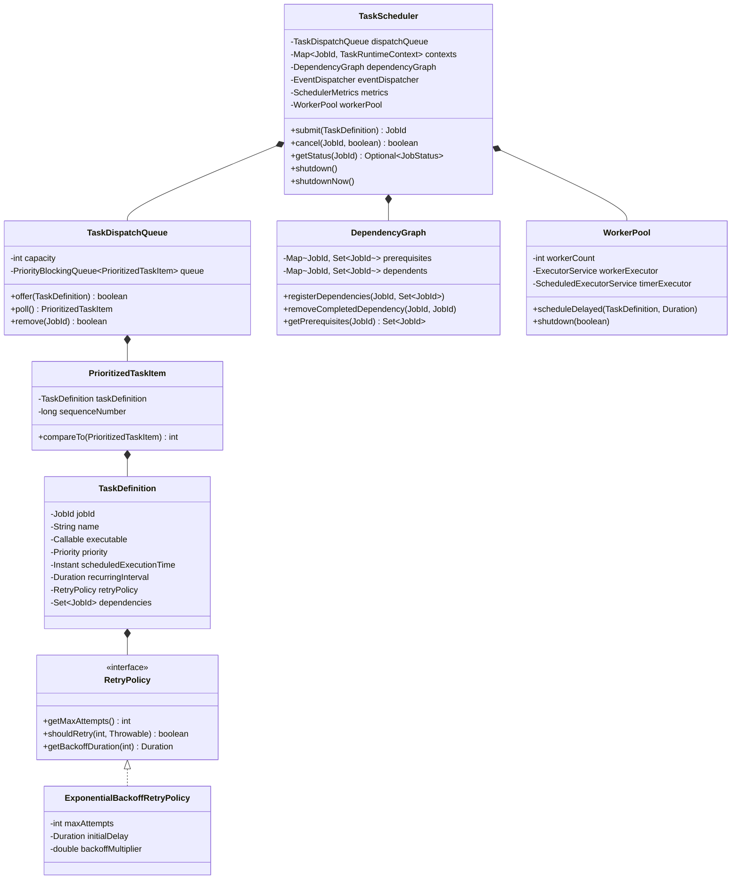

# Class Diagram: Concurrent Task Scheduling Engine

```mermaid
classDiagram
    class TaskScheduler {
        -TaskDispatchQueue dispatchQueue
        -Map~JobId, TaskRuntimeContext~ contexts
        -DependencyGraph dependencyGraph
        -EventDispatcher eventDispatcher
        -SchedulerMetrics metrics
        -WorkerPool workerPool
        +submit(TaskDefinition) JobId
        +cancel(JobId, boolean) boolean
        +getStatus(JobId) Optional~JobStatus~
        +shutdown()
        +shutdownNow()
    }

    class TaskDefinition {
        -JobId jobId
        -String name
        -Callable executable
        -Priority priority
        -Instant scheduledExecutionTime
        -Duration recurringInterval
        -RetryPolicy retryPolicy
        -Set~JobId~ dependencies
    }

    class TaskDispatchQueue {
        -int capacity
        -PriorityBlockingQueue~PrioritizedTaskItem~ queue
        +offer(TaskDefinition) boolean
        +poll() PrioritizedTaskItem
        +remove(JobId) boolean
    }

    class PrioritizedTaskItem {
        -TaskDefinition taskDefinition
        -long sequenceNumber
        +compareTo(PrioritizedTaskItem) int
    }

    class DependencyGraph {
        -Map~JobId, Set~JobId~~ prerequisites
        -Map~JobId, Set~JobId~~ dependents
        +registerDependencies(JobId, Set~JobId~)
        +removeCompletedDependency(JobId, JobId)
        +getPrerequisites(JobId) Set~JobId~
    }

    class WorkerPool {
        -int workerCount
        -ExecutorService workerExecutor
        -ScheduledExecutorService timerExecutor
        +scheduleDelayed(TaskDefinition, Duration)
        +shutdown(boolean)
    }

    class RetryPolicy {
        <<interface>>
        +getMaxAttempts() int
        +shouldRetry(int, Throwable) boolean
        +getBackoffDuration(int) Duration
    }

    class ExponentialBackoffRetryPolicy {
        -int maxAttempts
        -Duration initialDelay
        -double backoffMultiplier
    }

    TaskScheduler *-- TaskDispatchQueue
    TaskScheduler *-- DependencyGraph
    TaskScheduler *-- WorkerPool
    TaskDispatchQueue *-- PrioritizedTaskItem
    PrioritizedTaskItem *-- TaskDefinition
    RetryPolicy <|.. ExponentialBackoffRetryPolicy
    TaskDefinition *-- RetryPolicy
```
