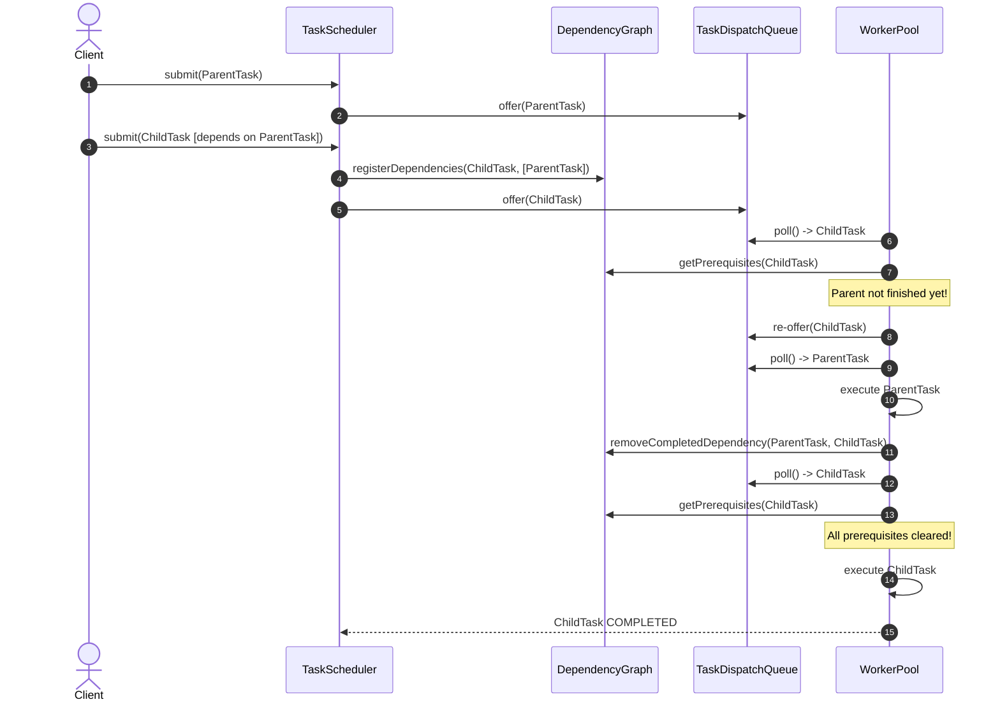
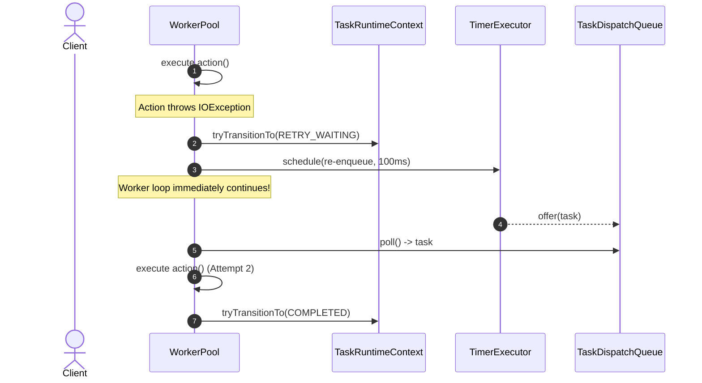

# Sequence Diagrams: Concurrent Task Scheduling Engine

## 1. Dependent Task Execution Workflow

```mermaid
sequenceDiagram
    autonumber
    actor Client
    participant Scheduler as TaskScheduler
    participant DAG as DependencyGraph
    participant Queue as TaskDispatchQueue
    participant Worker as WorkerPool

    Client->>Scheduler: submit(ParentTask)
    Scheduler->>Queue: offer(ParentTask)
    Client->>Scheduler: submit(ChildTask [depends on ParentTask])
    Scheduler->>DAG: registerDependencies(ChildTask, [ParentTask])
    Scheduler->>Queue: offer(ChildTask)

    Worker->>Queue: poll() -> ChildTask
    Worker->>DAG: getPrerequisites(ChildTask)
    Note over Worker: Parent not finished yet!
    Worker->>Queue: re-offer(ChildTask)

    Worker->>Queue: poll() -> ParentTask
    Worker->>Worker: execute ParentTask
    Worker->>DAG: removeCompletedDependency(ParentTask, ChildTask)

    Worker->>Queue: poll() -> ChildTask
    Worker->>DAG: getPrerequisites(ChildTask)
    Note over Worker: All prerequisites cleared!
    Worker->>Worker: execute ChildTask
    Worker-->>Scheduler: ChildTask COMPLETED
```

## 2. Exponential Backoff Retry Workflow

```mermaid
sequenceDiagram
    autonumber
    actor Client
    participant Worker as WorkerPool
    participant Context as TaskRuntimeContext
    participant Timer as TimerExecutor
    participant Queue as TaskDispatchQueue

    Worker->>Worker: execute action()
    Note over Worker: Action throws IOException
    Worker->>Context: tryTransitionTo(RETRY_WAITING)
    Worker->>Timer: schedule(re-enqueue, 100ms)
    Note over Worker: Worker loop immediately continues!
    Timer-->>Queue: offer(task)
    Worker->>Queue: poll() -> task
    Worker->>Worker: execute action() (Attempt 2)
    Worker->>Context: tryTransitionTo(COMPLETED)
```
